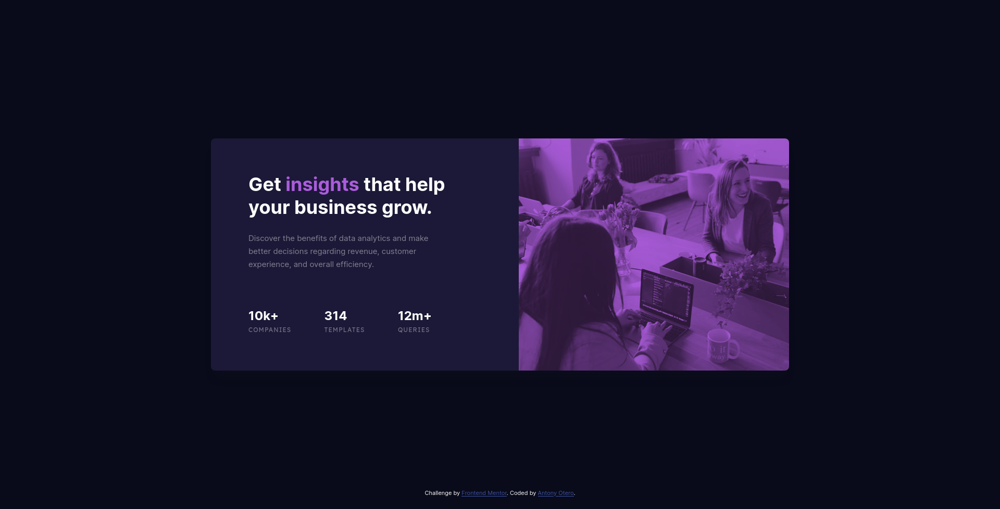

# Frontend Mentor - Stats preview card component solution

This is a solution to the [Stats preview card component challenge on Frontend Mentor](https://www.frontendmentor.io/challenges/stats-preview-card-component-8JqbgoU62). Frontend Mentor challenges help you improve your coding skills by building realistic projects. 

## Table of contents

- [Overview](#overview)
  - [The challenge](#the-challenge)
  - [Screenshot](#screenshot)
  - [Links](#links)
- [My process](#my-process)
  - [Built with](#built-with)
  - [What I learned](#what-i-learned)
- [Author](#author)

## Overview

### The challenge

Users should be able to:

- View the optimal layout depending on their device's screen size

### Screenshot



### Links

- Solution URL: [See my solution at frontendmentor.io](https://www.frontendmentor.io/solutions/stats-preview-card-with-media-queries-3CCtEXZ0k)
- Live Site URL: [https://antonyotero.github.io/stats-preview-card-component-main/](https://antonyotero.github.io/stats-preview-card-component-main/)

## My process

### Built with

- CSS custom properties
- Flexbox
- CSS Grid
- Mobile-first workflow

### What I learned

I learned a bit about how to use blend-modes to change the color of an image. I experimented for a bit and got it working by creating a `div` element and nesting inside of it another `div` element to which I set a background image.
```html
<div class="header">
  <div class="header_image"></div>
</div>
```

I then set the `background-image` to the image I wanted to use and then set the `mix-blend-mode` to `multiply`, and its `opacity` to `0.75`.
```css
.header {
  background: #AB5CDB;
  border-radius: 8px 8px 0 0;
}

.header_image {
  width: 100%;
  height: 240px;
  background-image: url(./images/header-mobile.jpg);
  background-size: cover;
  mix-blend-mode: multiply;
  opacity: 0.75;
}

```
In the media query, I swap out the image for the one that will be displayed on desktop.
```css
@media screen and (min-width: 1140px) {
  .header_image {
    background-image: url(./images/header-desktop.jpg);
  }
}
```

## Author

- Website - [Antony Otero](https://github.com/AntonyOtero)
- Frontend Mentor - [@AntonyOtero](https://www.frontendmentor.io/profile/AntonyOtero)
- Twitter - [@AntonyOtero](https://www.twitter.com/AntonyOtero)